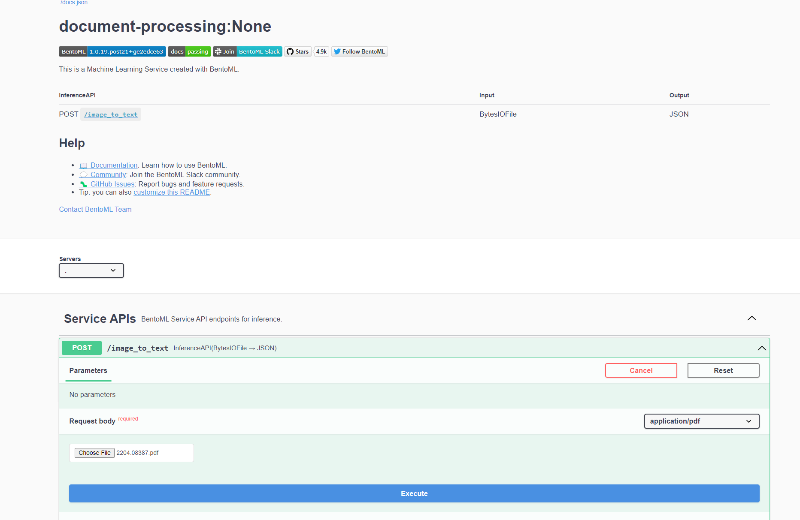

<div align="center">
    <h1 align="center">BentoOCR</h1>
    <br>
    <strong>Turn any OCR models into online inference API endpoint 🚀<br></strong>
    <i>Powered by BentoML 🍱</i>
    <br>
</div>
<br>

## 📖 Introduction 📖

This project demonstrates how to effortlessly serve an OCR model using BentoML. It accepts PDFs as input and returns the text contained within. The service uses [EasyOCR](https://github.com/JaidedAI/EasyOCR) for OCR.

## 🏃‍♂️ Running the Service 🏃‍♂️

### BentoML CLI

#### **Prerequisite 📋**

#### ✅ Python

This project requires Python 3.10 or higher.

Make sure to install [uv](https://docs.astral.sh/uv/)

```bash
git clone https://github.com/bentoml/BentoOCR.git && cd BentoOCR

uv venv

python import_model.py
```

To serve the model with BentoML:

```bash
bentoml serve
```

You can then open your browser at http://127.0.0.1:3000 and interact with the service through Swagger UI.

## 🌐 Interacting with the Service 🌐

BentoML's default model serving method is through an HTTP server. In this section, we demonstrate various ways to interact with the service:

### cURL

```bash
curl -X 'POST' \
  'http://localhost:3000/image_to_text' \
  -H 'accept: application/pdf' \
  -H 'Content-Type: multipart/form-data' \
  -F file=@path-to-pdf
```

> Replace `path-to-pdf` with the file path of the PDF you want to send to the service.

### Swagger UI

You can use Swagger UI to quickly explore the available endpoints of any BentoML service.


## 🚀 Deploying to Production 🚀

Effortlessly transition your project into a production-ready application using [BentoCloud](https://www.bentoml.com/bento-cloud/), the production-ready platform for managing and deploying machine learning models.

Start by creating a BentoCloud account. Once you've signed up, log in to your BentoCloud account using the command:

```bash
bentoml cloud login --api-token <your-api-token> --endpoint <bento-cloud-endpoint>
```

> Note: Replace `<your-api-token>` and `<bento-cloud-endpoint>` with your specific API token and the BentoCloud endpoint respectively.

Next, build your BentoML service using the `build` command:

```bash
bentoml build
```

Then, push your freshly-built Bento service to BentoCloud using the `push` command:

```bash
bentoml push <name:version>
```

Lastly, deploy this application to BentoCloud with a single `bentoml deployment create` command following the [deployment instructions](https://docs.bentoml.org/en/latest/reference/cli.html#bentoml-deployment-create).

BentoML offers a number of options for deploying and hosting online ML services into production, learn more at [Deploying a Bento](https://docs.bentoml.org/en/latest/concepts/deploy.html).

## 👥 Community 👥

BentoML has a thriving open source community where thousands of ML/AI practitioners are
contributing to the project, helping other users and discussing the future of AI. 👉 [Pop into our Slack community!](https://l.bentoml.com/join-slack)
